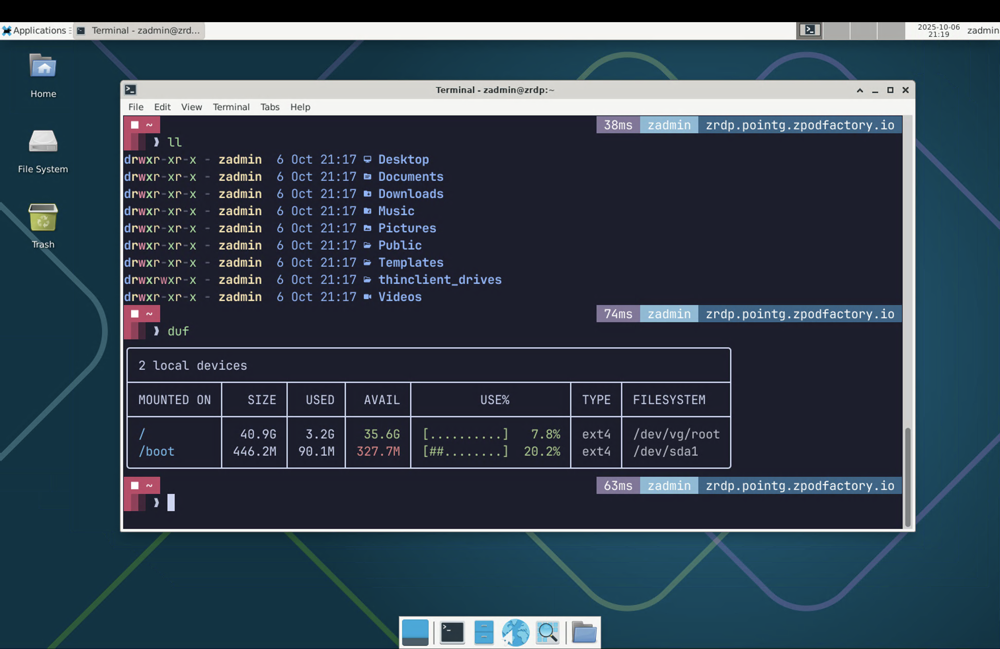

# zBox Desktop Appliance

Based on [zBox](https://github.com/zPodFactory/packer-zbox)

Opinionated Remote Desktop Graphical Linux Appliance setup for my personal use.
Just RDP to the VM with the `zadmin` credentials and you're good to go.

> [!NOTE]
> This is a work in progress and will be updated over time.

## Purpose

My personal *all-in-one* Desktop VM for dev and testing.

- Fancy zsh prompt shell (oh-my-zsh/posh/custom theme)
- Pre-configured apt sources lists for docker, kubernetes, powershell, hashicorp, tailscale
- LVM2 based storage configuration (`zbox-init.sh --extend-disk` will automatically extend the disk to the max size of the disk through lvm)
- Various misc tools

Easily deploy the appliance using the provided `OVF Properties` or `cloud-init` configuration.

## Downloads

Latest builds are available here:

- https://cloud.tsugliani.fr/ova/zboxdesktop-13.1.ova


## Deployment examples

For both examples we will be using the [govc](https://github.com/vmware/govmomi/releases) cli tool to deploy the appliance.

A basic configuration for govc is to export the appropriate variables in your shell environment.
For example I use the following `xyz.env` file:


```bash
export GOVC_INSECURE=true
export GOVC_URL="https://vc/sdk"

export GOVC_USERNAME="username"
export GOVC_PASSWORD="password"

export GOVC_DATACENTER="Datacenter"
export GOVC_DATASTORE="vsanDatastore"
```

This way I can source the file in my shell session and have the appropriate target environment ready to use through the `govc` cli tool. (easy to manage multiple target environments this way for quick testing)

```bash
source xyz.env
```

Then I can use the `govc` cli tool to deploy the appliance, either using the `OVF Properties` or the `cloud-init` configuration.

### OVF Properties Deployment

Sample configuration for OVF Properties deployment where it will setup the networking, the root/zadmin password and ssh key.

`ovfproperties.json` (adapt to your environment):

```json
{
  "DiskProvisioning": "flat",
  "IPAllocationPolicy": "dhcpPolicy",
  "IPProtocol": "IPv4",
  "PropertyMapping": [
    {
      "Key": "guestinfo.hostname",
      "Value": "zboxdesktop"
    },
    {
      "Key": "guestinfo.ipaddress",
      "Value": "10.10.42.139"
    },
    {
      "Key": "guestinfo.netprefix",
      "Value": "24"
    },
    {
      "Key": "guestinfo.gateway",
      "Value": "10.10.42.1"
    },
    {
      "Key": "guestinfo.dns",
      "Value": "10.10.42.254"
    },
    {
      "Key": "guestinfo.domain",
      "Value": "ovfproperty.lab"
    },
    {
      "Key": "guestinfo.password",
      "Value": "zboxisamazing2025!"
    },
    {
      "Key": "guestinfo.sshkey",
      "Value": "ssh-rsa AAAAB3NzaC1yc2EAAAADAQABAAABAQC/i56xhpfJKBC9TaL4BlPP3eDY03Csf4aLIM4OkSGDlTwNbadu5doGb8x/Z7650xsxXTuDq22UEVv0fuklc3DCl3NP9yv27LNj54g9WZPrC0wlDZOblvQo52atjkh4SIYZp5Rn9FFY+Vwc5/c3widbZ8OrNynS4QkKWrZHfmrjzWR0ZwGZPgTNxRiD0db6XVfxAxr3MuTKEd2yKlWenS8+ZEKnjR1nhEC6awmkt8p/uNZvyKHcVQ4Goyeo6EKaJf5JtdSV6mnN0lL3URuvDefrJygFzTNqhu1bwiXQl/zG969HaAkNRA4FhM2BIziIjCAzXrmQoaY8+5bWDXJg3kdp root@zPodMaster"
    }
  ],
  "NetworkMapping": [
    {
      "Name": "VM Network",
      "Network": "Segment-Dev-Lab"
    }
  ],
  "MarkAsTemplate": false,
  "PowerOn": true,
  "InjectOvfEnv": true,
  "WaitForIP": false,
  "Name": null
}
```

> [!NOTE]
> the `PowerOn` flag is set to `true` and will automatically power on the VM after deployment.


```bash
govc import.ova -name zboxdesktop -options ovfproperties.json https://cloud.tsugliani.fr/ova/zboxdesktop-13.1.ova
```

Wait a moment for the VM to be uploaded, created and it should be available with the provided IP address/credentials from the `ovfproperties.json` file.

### cloud-init Deployment

Not supported yet.

## Screenshots

Some screenshots of the appliance using some of the installed tools.



## Packer setup

If you want to build and/or modify the appliance yourself, you can follow the below steps.

Set your `zboxdesktop-builder.json` file with the correct parameters from the provided example file.

```bash
cp zboxdesktop-builder.json.sample zboxdesktop-builder.json
```

Edit the required values in the `zboxdesktop-builder.json` file to reflect your builder environment.

```bash
vi zboxdesktop-builder.json
```
> [!WARNING]
> This step requires you to have a proper VMware ESXi environment prepared for packer to use.
> You can use [William Lam](https://williamlam.com) provided [Nested ESXi Virtual Appliances](https://brcm.tech/flings) to build the zBox appliance.

Then you can build the appliance using the provided `build-zboxdesktop.sh` script.

```bash
./build-zboxdesktop.sh
```
This should take around 15 minutes to build the appliance and find the OVA file in the `output-zboxdesktop-xyz` directory. (adapt to your version)

```bash
ls -l output-zboxdesktop-xyz/*.ova
```

